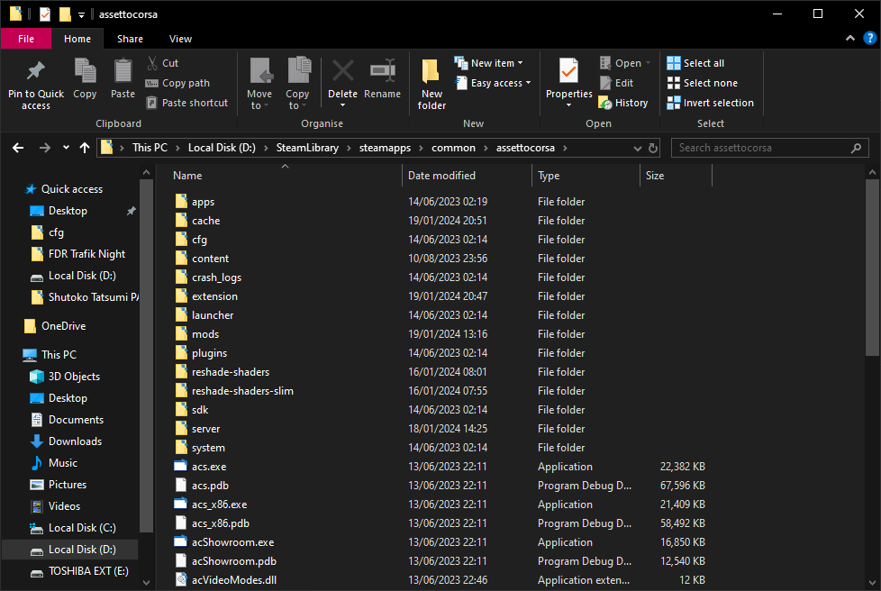
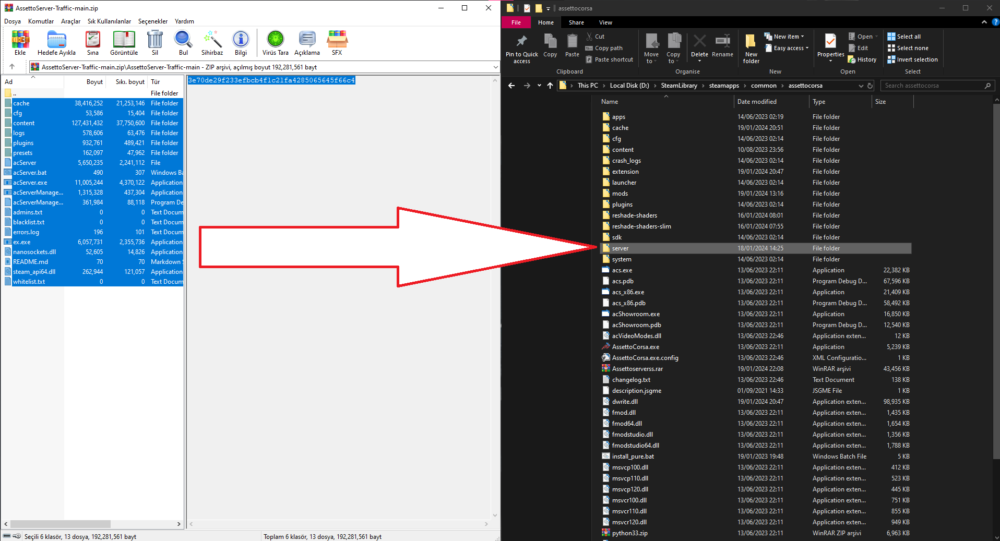
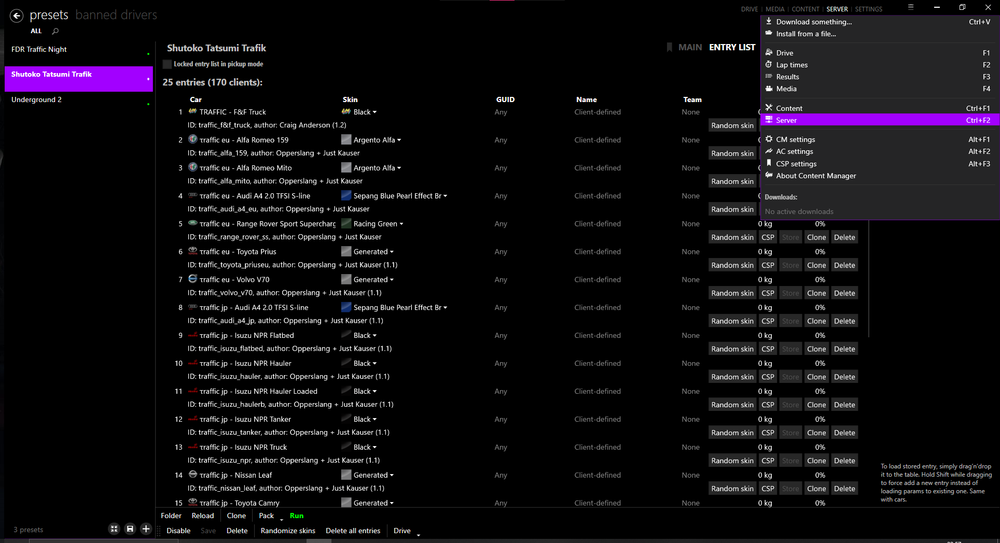
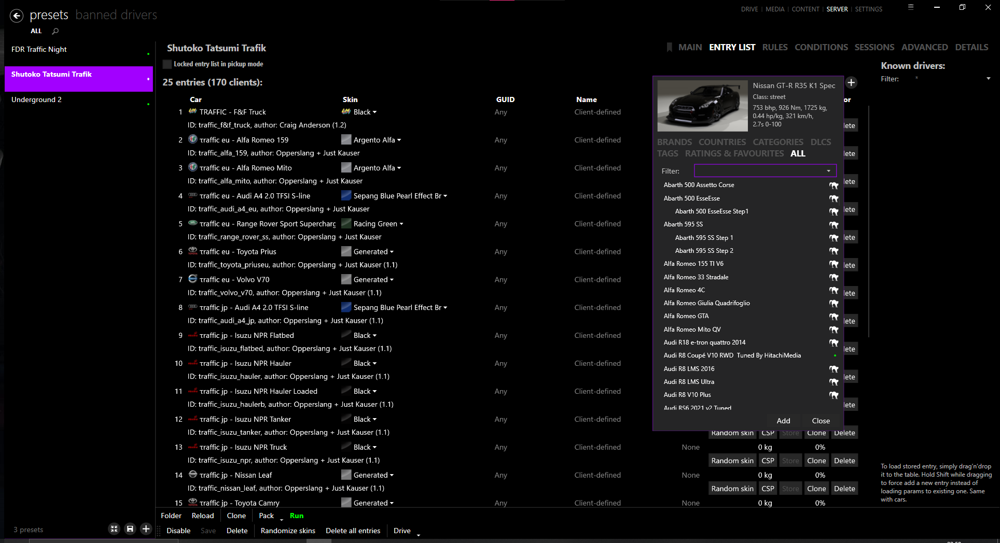

# Assetto Corsa Server Template

## 👥 Creators
* [Sezynex](https://github.com/sezynex)
* [corp14x3](https://github.com/corp14x3)

---

## 📢 Latest Update
> 🏁 **What's New:** The latest update officially introduces full **Race System** support to the template, allowing you to easily host structured race sessions alongside casual cruising.

---

## 🛠️ Setup Tutorial

### Step 1: Find the Assetto Corsa Root Folder
Open the main installation (root) folder where Assetto Corsa is installed on your computer.


### Step 2: Move the Files
Move the downloaded template files directly into this root folder.


### Step 3: Open Content Manager
Launch Content Manager and navigate to the server management section.


### Step 4: Add Cars & Save
Add the cars you want to include in your server to the list, then save your configuration.


### Step 5: Launch the Server
Once everything is configured, click the **Run** button to start your server!

---

## 🌐 Playing with Friends (Radmin VPN / Hamachi Setup)
If you do not have a static IP address or port forwarding configured, you can use a virtual LAN gaming network like **Radmin VPN** (recommended for better stability) or **LogMeIn Hamachi** to play with friends:

1. Download and install either **Radmin VPN** or **Hamachi**.
2. Create a new private network within the application.
3. Have your friends download the same software and join the network you just created using your network name and password.
4. Once everyone is connected to the same virtual network, your server should appear under the **Online > LAN** tab inside Content Manager.

> 💡 **Note:** If your server is still not showing up, make sure the **"Make server public"** option is checked in the main server settings within Content Manager.

---

## 📌 Troubleshooting

### Fixing the "Register Lobby" Error:
1. Click the folder icon in the server settings to open the server directory.
2. Open the `server.cfg` file using a text editor (such as Notepad).
3. Find the line `REGISTER_TO_LOBBY=1` and change its value to `0`:
   ```text
   REGISTER_TO_LOBBY=0
  ```
4. Save and close the file.
