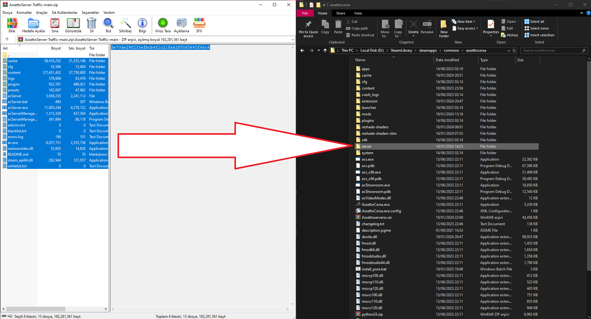

# Assetto Server Template

## Creators

[Sezynex](https://github.com/sezynex)\
[corp14x3](https://github.com/corp14x3)

## Setup Tutorial
Find Assetto Corsa Root Folder\

Move Files To Folder\

And Go Content Manager\

Add Car & Save\

Click Run !                                                                                         

If you dont have server\
Download Hamachi\
Create a new network\
And say your aga "download hamachi aq"\
And your aga joins your network\
Now you should be see your server in Online>Lan\
If your server is not looking Check the box in main server settings in your content manager "Make server public"\

[Traffic Cars](https://link.tc/go/bRdVI)\
[Shutoko](https://link.tc/go/y5hIF)\
[FDR Map](https://link.tc/go/rQE93)\
[Underground2 Map ](https://link.tc/go/3YmWX)
